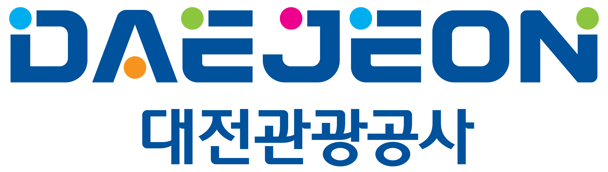
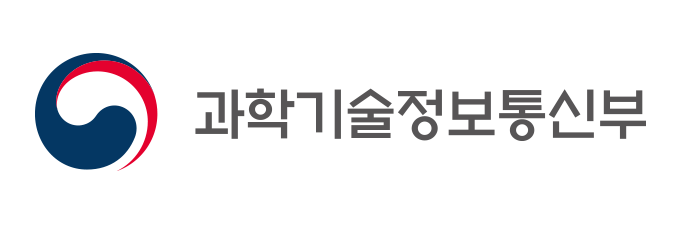
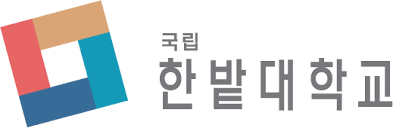


Check DC curriculum





It looks like you are setting up a website for a Data Carpentry curriculum but you haven't specified the curriculum type in the <code>_config.yml</code> file (current value in <code>_config.yml</code>: "<strong>{{ site.curriculum }}</strong>", possible values: <code>dc-astronomy</code>, <code>dc-ecology</code>, <code>dc-genomics</code>, <code>dc-socsci</code>, or <code>dc-geospatial</code>). After editing this file, you need to run <code>make serve</code> again to see the changes reflected.





<strong>Some adblockers block the registration window. If you do not see the
  registration box below, please check your adblocker settings.</strong>
<iframe
  src="https://www.eventbrite.com/tickets-external?eid={{page.eventbrite}}&ref=etckt"
  frameborder="0"
  width="100%"
  height="280px"
  scrolling="auto">
</iframe>


<h2 id="general">일반 정보</h2>


INTRODUCTION

Edit the general explanatory paragraph below if you want to change
the pitch.










This is a pilot workshop, testing out a lesson that is still under development. The lesson authors would appreciate any feedback you can give them about the lesson content and suggestions for how it could be further improved.



AUDIENCE

Explain who your audience is.  (In particular, tell readers if the
workshop is only open to people from a particular institution.










LOCATION

This block displays the address and links to maps showing directions
if the latitude and longitude of the workshop have been set.  You
can use https://www.latlong.net/ to find the lat/long of an
address.











  <strong>장소:</strong>
  {{page.address}}.
  <a href="//www.openstreetmap.org/?mlat={{page.latitude}}&mlon={{page.longitude}}&zoom=16">OpenStreetMap</a>
  혹은
  <a href="//maps.google.com/maps?q={{page.latitude}},{{page.longitude}}">Google Maps</a> 참조.



  <strong>Where:</strong>
  online at <a href="{{page.address}}">{{page.address}}</a>.
  If you need a password or other information to access the training,
  the instructor will pass it on to you before the workshop.



  <strong>Where:</strong> This training will take place online.
  The instructors will provide you with the information you will need to connect to this meeting.




DATE

This block displays the date and links to Google Calendar.



  <strong>일시:</strong>
  {{page.humandate}}.
  




SPECIAL REQUIREMENTS

Modify the block below if there are any special requirements.


  <strong>요구사항:</strong>
  
  
    Participants must bring a laptop with a
    Mac, Linux, or Windows operating system (not a tablet, Chromebook, etc.) that they have administrative privileges on.
  
  워크샵 참석자는 관리자 권한을 갖는 맥/리눅스/윈도 운영체제를 탑재한 노트북을 지참하여 참석하여야 하며 가능하면 뜻을 같이 하는 친구와 함께 적극적인 참여를 권장합니다. 태블릿, 크롬북 등은 불가합니다.
  
  노트북에는 <a href="#setup">아래</a> 기술된 특정 소프트웨어 패키지를 설치해와야 합니다.


ACCESSIBILITY

Modify the block below if there are any barriers to accessibility or
special instructions.


  <strong>Accessibility:</strong>

  We are committed to making this workshop
  accessible to everybody.  For workshops at a physical location, the workshop organizers have checked that:

<ul>
  <li>The room is wheelchair / scooter accessible.</li>
  <li>Accessible restrooms are available.</li>
</ul>

  Materials will be provided in advance of the workshop and
  large-print handouts are available if needed by notifying the
  organizers in advance.  If we can help making learning easier for
  you (e.g. sign-language interpreters, lactation facilities) please
  get in touch (using contact details below) and we will
  attempt to provide them.


  We are dedicated to providing a positive and accessible learning environment for all. Please
  notify the instructors in advance of the workshop if you require any accommodations or if there is
  anything we can do to make this workshop more accessible to you.




CONTACT EMAIL ADDRESS

Display the contact email address set in the configuration file.


  <strong>연락처:</strong>
  전자우편
  
  
  
  or
  
  
  ,
  
  
  <a href='mailto:{{email}}'>{{email}}</a>
  
  
  to-be-announced
   주소로 연락주세요.

  <strong>Roles:</strong>
  To learn more about the roles at the workshop (who will be doing what),
  refer to <a href="https://carpentries.org/workshop_faq/#what-are-the-roles-of-everyone-participating-in-a-workshop">our Workshop FAQ</a>.


WHO CAN ATTEND?

If you would like to specify who can attend the workshop,
you can use the section below.

Move the 'endcomment' tag above the beginning of the following

 tag to make this section visible.

Edit the text to match who can attend the workshop. For instance:
- This workshop is open to affiliates to ABC university.
- This workshop is open to the public.
- If you are interested in attending this workshop, contact me@example.com
  for more information

    <strong>Who can attend?:</strong>
    This workshop is open to ....



<h2 id="code-of-conduct">행동강령(Code of Conduct)</h2>

Everyone who participates in Carpentries activities is required to conform to the <a href="https://docs.carpentries.org/topic_folders/policies/code-of-conduct.html">Code of Conduct</a>. This document also outlines how to report an incident if needed.

  <a href="https://goo.gl/forms/KoUfO53Za3apOuOK2">
    <button type="button" class="btn btn-info">Report a Code of Conduct Incident</button>
  </a>

<h2 id="collaborative_notes">공동 메모장(Collaborative Notes)</h2>

노트필기, 채팅, URL과 코드를 공유하는데 <a href="{{ page.collaborative_notes }}">collaborative document</a> 을 사용합니다. 강사를 포함한 누구나 워크샵 관련 참여자 모두에게 도움이 될 수 있는 사항을 남길 수 있습니다.

<h2 id="schedule">일정</h2>



<h2 id="setup">환경설정</h2>

  
  Software Carpentry
  
  Data Carpentry
  
  Library Carpentry
  
  (데이터 카펜트리) 워크샵에 참여하기 위해서, 다음에 기술된 소프트웨어 툴체인을 구축하여 
사전에 동작하게 만들 필요가 있다. 워크샵 시작전에 필요한 모든 소프트웨어가 설치되었는지 확인한다.
(적어도 소프트웨어를 다운로드하거나 인스톨러를 준비)

  데이터 카펜트리에서 
  <a href = "{{site.swc_github}}/workshop-template/wiki/Configuration-Problems-and-Solutions">환경설치 문제점과 해결책에 대한 위키 페이지</a>를 운영하고 있으니
  설치시 참조한다..

<h2 id="sponsor">후원</h2>

이 프로그램은 과학기술진흥기금 및 복권기금의 재원으로 운영되고, 과학기술정보통신부와 한국과학창의재단의 지원을 받아 수행된 성과물로 우리나라의 과학기술 발전과 사회적 가치 증진에 기여하고 있습니다.

  <table class="table">
    <tr> 
      <td> 
          
      </td>
      <td>
          
      </td>
      <td>
          
      </td>
      <td>
          
      </td>
      <td>
          
      </td>
      <td>
          대전과학문화거점센터
      </td>
    </tr>
  </table>

